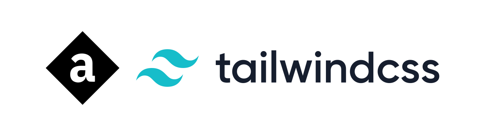

<!-- markdownlint-disable MD033 MD041 -->

  
   
  A configuration to use <a href="https://github.com/animate-css/animate.css">Animate.css</a> with
  <a href="https://github.com/tailwindlabs/tailwindcss">Tailwind CSS</a>.
   
   
  
  
  
  
  
  

---

## Credits

- [Animate.css](https://github.com/animate-css/animate.css) &ndash; for animation utilities & keyframes &ndash; used under [the MIT license](https://cdn.jsdelivr.net/npm/animate.css@4.1.1/LICENSE).
- [Transform.tools](https://github.com/ritz078/transform) &ndash; for converting Animate.css to JS &ndash; used under [the MIT license](https://github.com/ritz078/transform/blob/master/LICENSE).
